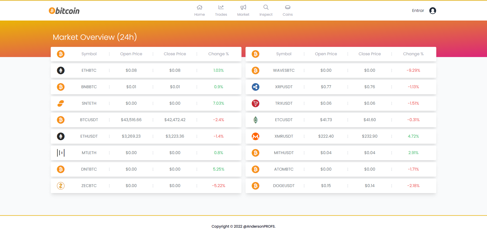

## Technologies used

<p align="center">


  
  
  
</p>

## Live Stream
Go to live preview [http://localhost:3000](http://localhost:3000).

## Getting Started

Start development server:

```bash
#Installs all the dependencies defined in a package.json file.
$ yarn

#Run project in developer mode.
$ yarn dev 
```

## Master Coin WebSocket Template Simple
Open [http://localhost:3000](http://localhost:3000) with your browser to see the result.
<p align="center">
  
</p>

[API routes](https://nextjs.org/docs/api-routes/introduction) can be accessed on [http://localhost:3000/api/hello](http://localhost:3000/api/hello). This endpoint can be edited in `pages/api/hello.ts`.